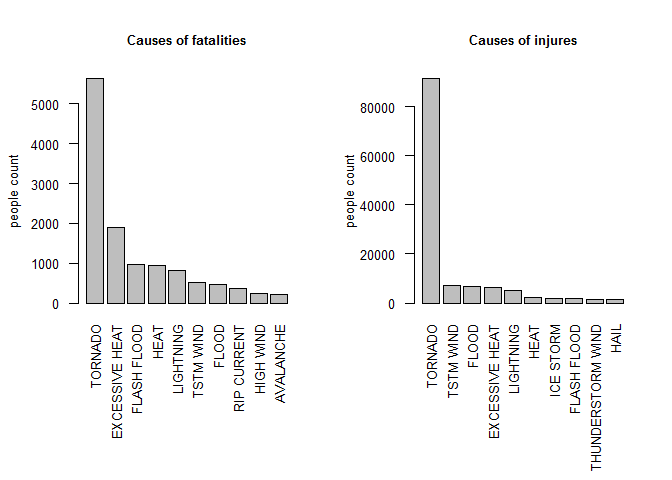
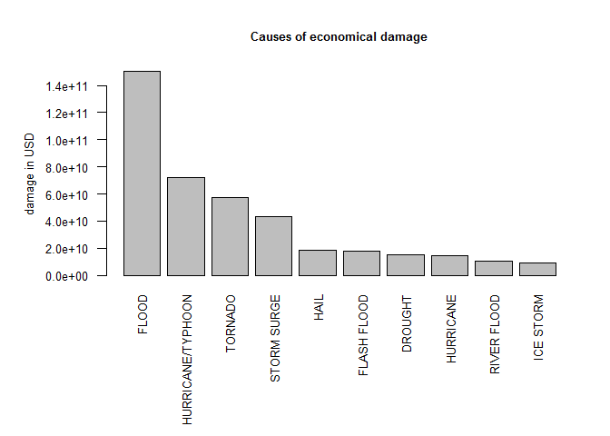

# Studying the most harmful weather events in the US in the period from 1950 to 2011

# Synopsis

In this analysis we aim to explore the U.S. National Oceanic and Atmospheric Administration's (NOAA) storm database which tracks characteristics of major storms and weather events in the United States. Data includes when and where the events occur, as well as estimates of any fatalities, injuries, and property damage.
The addressed questions were:  
Across the United States, which types of events are most harmful with respect to population health?  
Across the United States, which types of events have the greatest economic consequences?  

We used mainly 'base' and 'dplyr' package to transform, group and summarize the data.  

The analysis resulted with following answers:  
Tornado was the most harmful event for people's health having 5633 people dead and 91346 injured.  
Flood had the greatest consequences with more than 150 billion dollars of economical damage.  

# Data Processing 

## Downloading the data
First we download the data from [this source](https://d396qusza40orc.cloudfront.net/repdata%2Fdata%2FStormData.csv.bz2) and store it in our R working directory (we skip the step if the file is already there)

```r
if(!file.exists("StormData.csv.bz2")) {
      link <- "https://d396qusza40orc.cloudfront.net/repdata%2Fdata%2FStormData.csv.bz2"
      download.file(link, "StormData.csv.bz2")
}
```

## Reading in the data

We directly read in the global dataset stored in comma separated file inside bz2 archive

```r
StormData <- read.csv("StormData.csv.bz2", stringsAsFactors = FALSE)
```

We take a look at dataset dimensions

```r
dim(StormData)
```

```
## [1] 902297     37
```
So we have 902297 observations with 37 variables

Let's see the variables names

```r
names(StormData)
```

```
##  [1] "STATE__"    "BGN_DATE"   "BGN_TIME"   "TIME_ZONE"  "COUNTY"    
##  [6] "COUNTYNAME" "STATE"      "EVTYPE"     "BGN_RANGE"  "BGN_AZI"   
## [11] "BGN_LOCATI" "END_DATE"   "END_TIME"   "COUNTY_END" "COUNTYENDN"
## [16] "END_RANGE"  "END_AZI"    "END_LOCATI" "LENGTH"     "WIDTH"     
## [21] "F"          "MAG"        "FATALITIES" "INJURIES"   "PROPDMG"   
## [26] "PROPDMGEXP" "CROPDMG"    "CROPDMGEXP" "WFO"        "STATEOFFIC"
## [31] "ZONENAMES"  "LATITUDE"   "LONGITUDE"  "LATITUDE_E" "LONGITUDE_"
## [36] "REMARKS"    "REFNUM"
```

## Transforming and cleaning the data

For the purpose of our analysis we only keep following columns in dataset  
EVTYPE - the type of weather event occured  
FATALITIES - number of fatalities caused by weather event  
INJURIES - number of injuries caused by weather event  
PROPDMG - a numeric vector representing property damage in USD  
PROPDMGEXP -  magnitude of the PROPDMG number, (i.e. “K” for thousands, “M” for millions, and “B” for billions)   
CROPDMG - a numeric vector representing crop damage in USD
CROPDMGEXP - magnitude of the CROPDMG number, (i.e. “K” for thousands, “M” for millions, and “B” for billions)
Detailed description of global dataset is available in [Storm Data Documentation](https://d396qusza40orc.cloudfront.net/repdata%2Fpeer2_doc%2Fpd01016005curr.pdf)

Thus, we subset the global dataset for the listed variables

```r
var_names <- c("EVTYPE", "FATALITIES", "INJURIES", "PROPDMG", "PROPDMGEXP", "CROPDMG", "CROPDMGEXP")

storm_tidy <- StormData[var_names]
```

Let's check if there is any NAs in our tidy dataset

```r
sum(is.na(storm_tidy))
```

```
## [1] 0
```
Nope. Ok, we can move on.

Next step is normalize the damage values with respect to corresponding magnitude.  
First we take a look at magnitude variables:  

```r
table(storm_tidy$PROPDMGEXP)
```

```
## 
##             -      ?      +      0      1      2      3      4      5 
## 465934      1      8      5    216     25     13      4      4     28 
##      6      7      8      B      h      H      K      m      M 
##      4      5      1     40      1      6 424665      7  11330
```

```r
table(storm_tidy$CROPDMGEXP)
```

```
## 
##             ?      0      2      B      k      K      m      M 
## 618413      7     19      1      9     21 281832      1   1994
```

As we can see there are bunch of observations with not acceptable values in magnitude (not "K", "M" or "B").    
So we change to zero all of them.

```r
storm_tidy[!(storm_tidy$PROPDMGEXP %in% c("K", "k", "M", "m", "B", "b")), ]$PROPDMGEXP <- 0
storm_tidy[!(storm_tidy$CROPDMGEXP %in% c("K", "k", "M", "m", "B", "b")), ]$CROPDMGEXP <- 0
```

We check again the summary and see that now only the acceptable values are there

```r
table(storm_tidy$PROPDMGEXP)
```

```
## 
##      0      B      K      m      M 
## 466255     40 424665      7  11330
```

```r
table(storm_tidy$CROPDMGEXP)
```

```
## 
##      0      B      k      K      m      M 
## 618440      9     21 281832      1   1994
```

We transform magnitude from text to numeric multiplicator

```r
storm_tidy[storm_tidy$PROPDMGEXP %in% c("K", "k"), ]$PROPDMGEXP <- 1000
storm_tidy[storm_tidy$CROPDMGEXP %in% c("K", "k"), ]$CROPDMGEXP <- 1000
storm_tidy[storm_tidy$PROPDMGEXP %in% c("M", "m"), ]$PROPDMGEXP <- 10^6
storm_tidy[storm_tidy$CROPDMGEXP %in% c("M", "m"), ]$CROPDMGEXP <- 10^6
storm_tidy[storm_tidy$PROPDMGEXP %in% c("B", "b"), ]$PROPDMGEXP <- 10^9
storm_tidy[storm_tidy$CROPDMGEXP %in% c("B", "b"), ]$CROPDMGEXP <- 10^9
```

Now we add a new column which will hold total normalized damage in USD as sum of property and crop damages

```r
storm_tidy$tot_dmg_norm <- with(storm_tidy, PROPDMG*as.numeric(PROPDMGEXP) + CROPDMG*as.numeric(CROPDMGEXP))
```

To continue analysis we'll create a new dataset summarised by event type.  
We'll use library 'dplyr' for that. So we first load the library

```r
library(dplyr)
```

And then create dataset

```r
storm_grouped <- storm_tidy %>%
      group_by(EVTYPE) %>% 
      summarise(fatalities = sum(FATALITIES, na.rm = TRUE),
                injures = sum(INJURIES, na.rm = TRUE),
                total.damage = sum(tot_dmg_norm, na.rm = TRUE)) %>% 
      as.data.frame()
```


## Results

### The most harmful events for people's health
To find out the most harmful event with respect to population health we create two subsets corresponding to the total numbers of fatalities and injures

```r
fatal <- storm_grouped[c("EVTYPE", "fatalities")]
injur <- storm_grouped[c("EVTYPE", "injures")]
```

and sort both in descending order

```r
fatal <- arrange(fatal, desc(fatalities))
injur <- arrange(injur, desc(injures))
```

Thus, here are the most harmful events with respect to population health

```r
head(fatal, n = 5)
```

```
##           EVTYPE fatalities
## 1        TORNADO       5633
## 2 EXCESSIVE HEAT       1903
## 3    FLASH FLOOD        978
## 4           HEAT        937
## 5      LIGHTNING        816
```

```r
head(injur, n = 5)
```

```
##           EVTYPE injures
## 1        TORNADO   91346
## 2      TSTM WIND    6957
## 3          FLOOD    6789
## 4 EXCESSIVE HEAT    6525
## 5      LIGHTNING    5230
```
So Tornado is proven to be the most harmful event having 5633 people dead and 91346 injured.

Let's plot the result for top 10 events though

```r
par(mfrow = c(1,2), mar=c(9.1,4.1,4.1,2.1))
barplot(fatal[1:10,2], names.arg= fatal[1:10,1], 
        las=2, 
        cex.names = 0.8, 
        cex.axis = 0.8,
        cex.lab = 0.8,
        cex.main = 0.8,
        ylab = "people count",
        main = "Causes of fatalities")

barplot(injur[1:10,2], 
        names.arg= injur[1:10,1], 
        las=2, 
        cex.names = 0.8, 
        cex.axis = 0.8,
        cex.lab = 0.8,
        cex.main = 0.8,
        ylab = "people count",
        main = "Causes of injures")
```

<!-- -->

### Events that had the greatest economic consequences

Same methodology we apply to know which types of events had the greatest economic consequences.  
We create a subset and sort it:

```r
damage <- storm_grouped[c("EVTYPE", "total.damage")]
damage <- arrange(damage, desc(total.damage))
```


So here are our TOPs

```r
head(damage, n = 5)
```

```
##              EVTYPE total.damage
## 1             FLOOD 150319678250
## 2 HURRICANE/TYPHOON  71913712800
## 3           TORNADO  57352113590
## 4       STORM SURGE  43323541000
## 5              HAIL  18758221170
```
FLOOD had the greatest consequences with more than 150 billion dollars of damage (!)

Let's plot the result for top 10

```r
par(mfrow = c(1,1), mar=c(9.1,6.1,4.1,2.1))
barplot(damage[1:10,2], 
        names.arg= damage[1:10,1], 
        las=2, 
        cex.names = 0.8, 
        cex.axis = 0.8,
        cex.lab = 0.8,
        cex.main = 0.8,
        main = "Causes of economical damage")
title(ylab= "damage in USD", line = 4, cex.lab = 0.8)
```

<!-- -->


